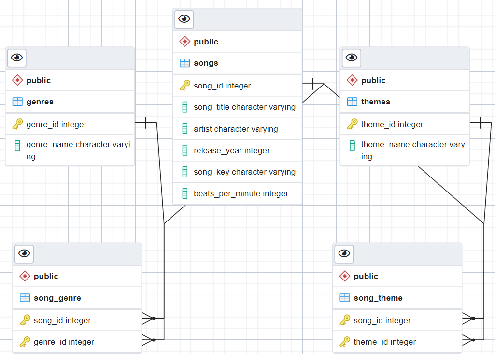

Music Therapy Playlist Database README

# Overview
This database is designed to manage and organize information about songs, genres, themes, and their relationships. It includes tables for storing details about songs, genres, themes, and the associations between songs and their themes and genres.

# Project Status
This is an ongoing project where I will continue to add more songs to the database over time. The aim is to expand and enrich the collection, incorporating a wide range of genres, themes, and styles. As music is ever-evolving and limitless in creativity, the additions will likely continue indefinitely. Stay tuned for regular updates and new entries!

# Designed for Music Therapists
This database provides a structured way to catalog and analyze music that can be highly beneficial for board-certified music therapists. Here’s how:
    
**Organized Song Information:** Therapists can easily access detailed information about songs, including their titles, artists, release years, musical keys, and tempos. This allows for quick identification of songs that meet specific therapeutic needs.
    
**Genre and Theme Association:** By categorizing songs by genres and themes, therapists can quickly find music that aligns with particular therapeutic goals, such as promoting relaxation, addressing emotional states, or supporting cognitive function.
    
**Efficient Music Selection:** The database allows therapists to search and filter music based on multiple criteria, saving time and ensuring that the selected music is both relevant and effective for therapy sessions.

**Importance of Beats Per Minute (BPM):** The inclusion of BPM in the database is particularly valuable for therapeutic practices focused on relaxation and stress reduction. Research has shown that music with a slower tempo, typically around 60-80 BPM, can promote relaxation and help lower heart rates.

# Database Schema
    

**Current Genres:**
Big Band, Blues, Calypso, Chicano Rock, Country, Doo-Wop, Folk, Honky Tonk, Jazz, Pop, Rhythm and Blues, Rock and Roll, Rockabilly, Standards, Swing, Western

**Current Themes:**
Acceptance, Adventure, Ambition, Anticipation, Appreciation,Betrayal, Cultural Appreciation, Confidence,Dance, Devotion, Escapism, Freedom, Fun, Goodbye, Happiness, Heartache, Hope,Independence, Infatuation, Isolation, Longing, Love, Nature, Nostalgia, Pain, Passion, Redemption, Regret,Resilience, Responsibility, Romance, Success, Work

# Relationships
songs can have multiple genres and themes.
genres and themes can be associated with multiple songs through the song_genre and song_theme tables respectively.

# Example Queries

Find all songs with the theme 'Love':

`SELECT song_title
FROM songs
JOIN song_theme ON songs.song_id = song_theme.song_id
JOIN themes ON song_theme.theme_id = themes.theme_id
WHERE themes.theme_name = 'Love';`

List all genres for a specific song:

`SELECT genre_name
FROM genres
JOIN song_genre ON genres.genre_id = song_genre.genre_id
JOIN songs ON song_genre.song_id = songs.song_id
WHERE songs.song_title = 'Song Title';`

Insert a new song:

`INSERT INTO songs (song_title, artist, release_year, song_key, beats_per_minute)
VALUES ('New Song', 'Artist Name', 2024, 'C major', 120);`

Add a genre to a song:

`INSERT INTO song_genre (song_id, genre_id)
VALUES ((SELECT song_id FROM songs WHERE song_title = 'Song Title'), (SELECT genre_id FROM genres WHERE genre_name = 'Genre Name'));`

Add a theme to a song:

`INSERT INTO song_theme (song_id, theme_id)
VALUES ((SELECT song_id FROM songs WHERE song_title = 'Song Title'), (SELECT theme_id FROM themes WHERE theme_name = 'Theme Name'));`

# Notes
Ensure that all foreign key references are valid when inserting data into song_theme and song_genre.

Use appropriate indices and constraints to maintain data integrity and optimize query performance.

